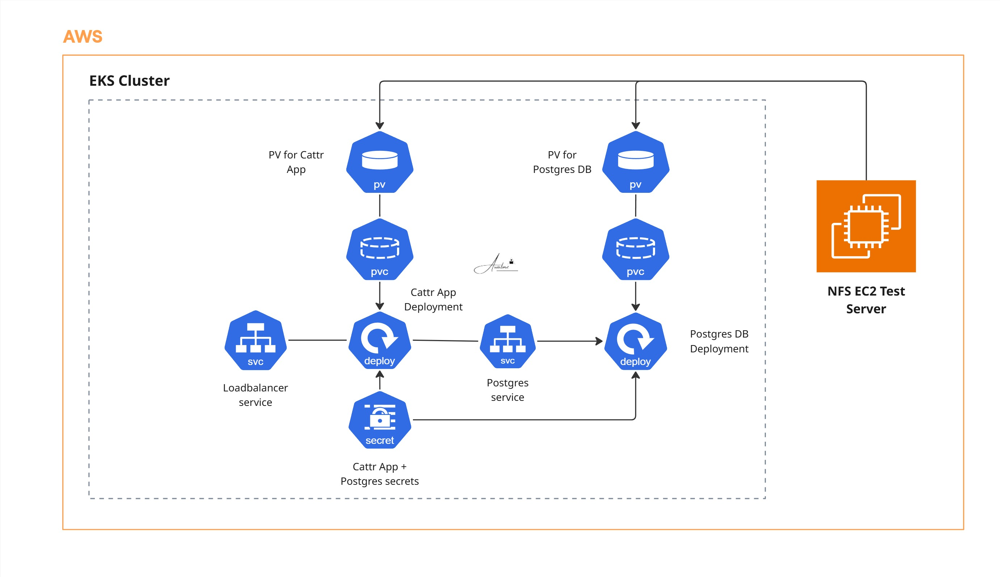

# Cattr Application Deployment on Kubernetes


## Overview

Deployed the Cattr time-tracking application on a Kubernetes cluster with a PostgreSQL database backend. The setup includes an NFS-backed PersistentVolume for the database with 5GB allocated, PersistentVolumeClaims for storage binding, and full Deployment + Service configuration for both Cattr and PostgreSQL.

## Architecture



The deployment consists of:
- **NFS PersistentVolume** for PostgreSQL data storage (5GB)
- **PersistentVolumeClaim** bound to the PV
- **PostgreSQL** Deployment + ClusterIP Service
- **Cattr** Deployment + Service connected to PostgreSQL

## Tech Stack

| Layer | Technology |
|-------|-----------|
| Container orchestration | Kubernetes |
| Application | Cattr (time tracking) |
| Database | PostgreSQL |
| Storage | NFS PersistentVolume (5GB) |
| Networking | Kubernetes Services |

## What Was Built

**1. NFS PersistentVolume**
- Created a PV using NFS as the storage backend for PostgreSQL data
- 5GB storage capacity allocated

**2. PersistentVolumeClaim**
- PVC bound to the NFS PV
- Mounted into the PostgreSQL Deployment for data persistence

**3. PostgreSQL Deployment + Service**
- PostgreSQL deployed with the PVC mounted at the data directory
- Exposed internally via ClusterIP Service for Cattr to connect

**4. Cattr Deployment + Service**
- Cattr application deployed and connected to PostgreSQL via environment variables
- Exposed via Kubernetes Service

## Project Structure

```
04-cattrApplication-DEVOPS/
├── pv-postgres.yaml          (NFS PersistentVolume)
├── pvc-postgres.yaml         (PersistentVolumeClaim)
├── postgres-deployment.yaml  (PostgreSQL Deployment + Service)
├── cattr-deployment.yaml     (Cattr Deployment + Service)
└── README.md
```

## Key Learnings

- Deploying PostgreSQL on Kubernetes with NFS-backed persistent storage
- Connecting a modern time-tracking application to a Kubernetes-native database service
- Managing stateful workloads with PersistentVolumes in a production cluster